# CERN Open Data Analysis

## Overview
This project analyzes LHC collision data from the CMS experiment using CERN Open Data to reconstruct the invariant mass spectrum of the Z boson decaying into muon pairs. It covers:

- Reading and processing ROOT files
- Histogram extraction of invariant mass
- Gaussian fitting of the mass distribution
- Visualization of histograms and fitted curves
- Exporting results as PNG plots, CSV, and JSON files

The project is implemented in both a Python script and Jupyter notebooks located in the `simulations/` folder for interactive exploration.

---

## Project Structure
```
CERN_Open_Data_Analysis/
│
├── data/
│ └── multiple ROOT files (*.root) from CMS Open Data
├── plots/
├── csvs/
├── jsons/
├── simulations/
│ ├── CERN_Open_Data_Analysis.ipynb
│ └── CERN_Open_Data_Analysis.py
├── requirements.txt
└── README.md
```

---

## Installation Instructions

1. **Clone the repository**
```bash
git clone https://github.com/mzohaibh17-pixel/CERN_Open_Data_Analysis.git
cd CERN_Open_Data_Analysis
```

2. **Create a virtual environment and activate it**
```bash
python -m venv venv
venv\Scripts\activate        # Windows
# source venv/bin/activate   # Linux / Mac
```

3. **Install dependencies**
```bash
pip install -r requirements.txt
```

---

## Features

- Reads ROOT files containing CMS Open Data
- Extracts Z → μ⁺μ⁻ invariant mass histograms
- Fits Gaussian curves to the mass spectrum
- Generates plots of histograms with Gaussian fits
- Saves outputs in multiple formats:
  - PNG plots (`plots/`)
  - CSV histograms (`csvs/`)
  - JSON fit parameters (`jsons/`)
- Easy-to-run Python script or Jupyter notebook

---

## Usage

1. Place ROOT files in the `data/` folder.

2. **Run the Jupyter notebook** (recommended):
```bash
jupyter notebook simulations/CERN_Open_Data_Analysis.ipynb
```
3. **Or run the Python script**:
```bash
python simulations/CERN_Open_Data_Analysis.py
```

- Plots, CSVs, and JSON files will be saved automatically in their respective folders (`plots/`, `csvs/`, `jsons/`).
- Interactive plots can also be displayed if your environment supports GUI (e.g., Jupyter notebook or Python IDE).

---

## Outputs

The project generates several outputs for each processed ROOT file:

- **Plots:** PNG images of the Z → μ⁺μ⁻ invariant mass histograms with the Gaussian fit overlaid. These plots are saved in the `plots/` folder and can be used for reports, presentations, or publications.  
- **CSV files:** Contain the histogram data, including bin centers and event counts. Stored in the `csvs/` folder, they allow further numerical analysis or reproduction of the plots.  
- **JSON files:** Store the Gaussian fit parameters (`amplitude`, `mean`, `sigma`) for each histogram. Located in the `jsons/` folder, these can be used for automated analysis, comparison, or further statistical work.

These outputs provide a complete record of the analysis, making it easy to reproduce the results, visualize data, or integrate into other computational workflows.

---

## Dependencies
```
- Python 3.x
- numpy
- uproot
- matplotlib
- mplhep
- pathlib
- scipy
```
*(All dependencies are included in `requirements.txt`)*

---

## References

- CERN Open Data Portal: https://opendata.cern.ch/
- CMS Experiment Open Data: https://cms.cern/
- uproot Documentation: https://uproot.readthedocs.io/
- mplhep Documentation: https://mplhep.readthedocs.io/
- scipy Documentation: https://docs.scipy.org/doc/scipy/

---

## Author / Credits

**Muhammad Zohaib Hassan**  
Bachelor’s in Physics, University of Sargodha  
GitHub: [mzohaibh17-pixel](https://github.com/mzohaibh17-pixel)  
Email: mzohaibh17@gmail.com  

This project is for educational and research purposes in computational physics.  
It is licensed under the **MIT License**, which requires including the copyright notice in any copies or substantial portions of the software.  
If you use, adapt, or fork this project, please give proper credit to the author.

---

## Visualizations

Invariant mass histograms with Gaussian fits for all ROOT files processed:

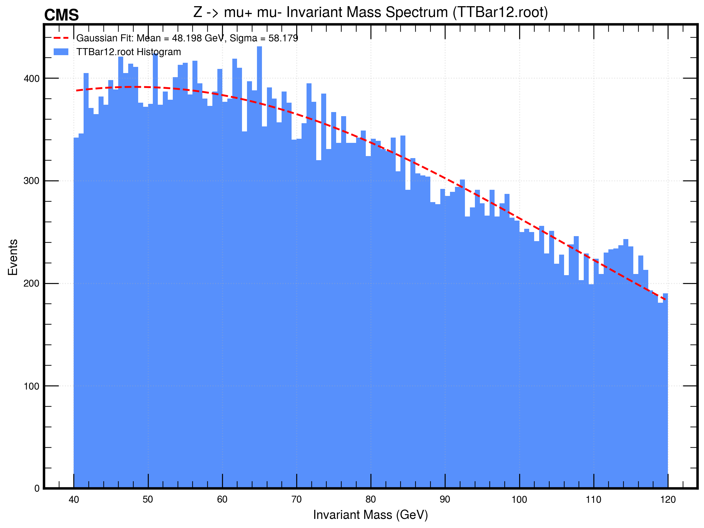  
*TTBar12: μ⁺μ⁻ Invariant Mass Spectrum*

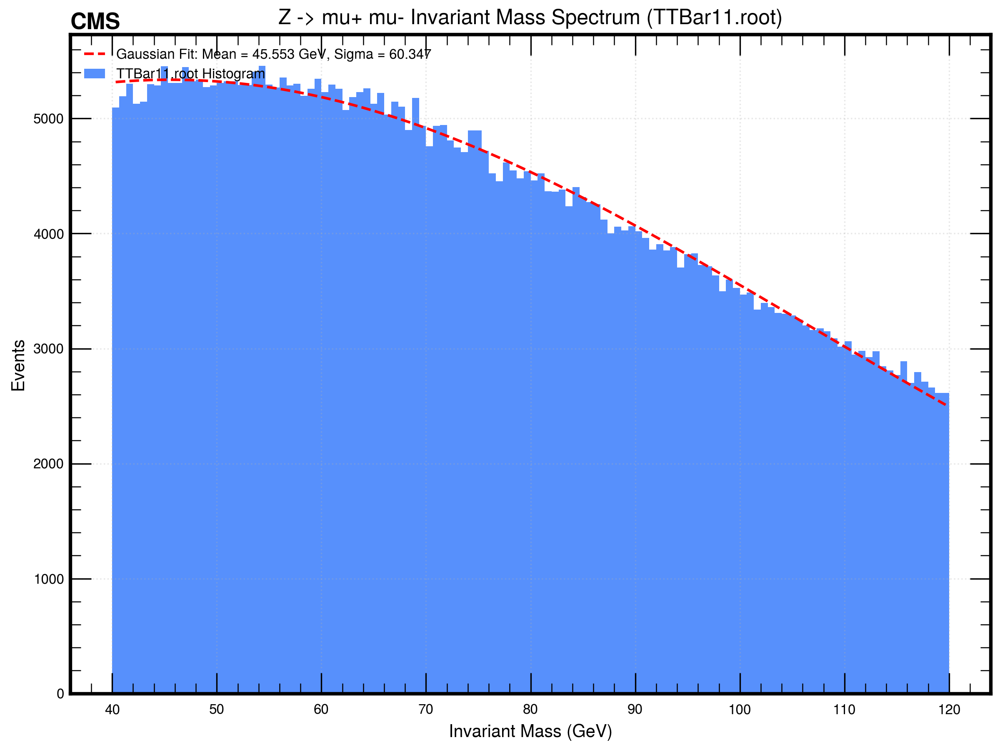  
*TTBar11: μ⁺μ⁻ Invariant Mass Spectrum*

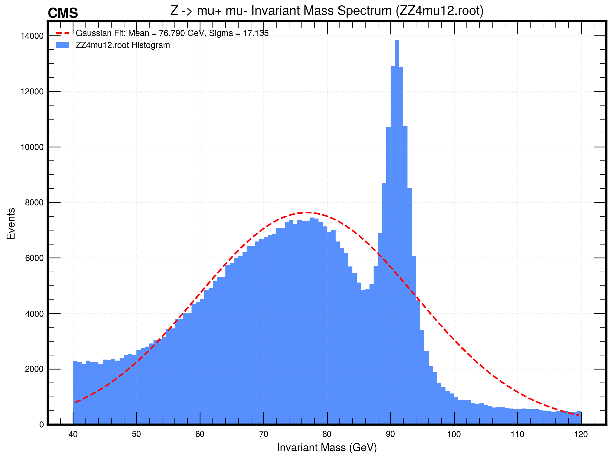  
*ZZ4mu12: μ⁺μ⁻ Invariant Mass Spectrum*

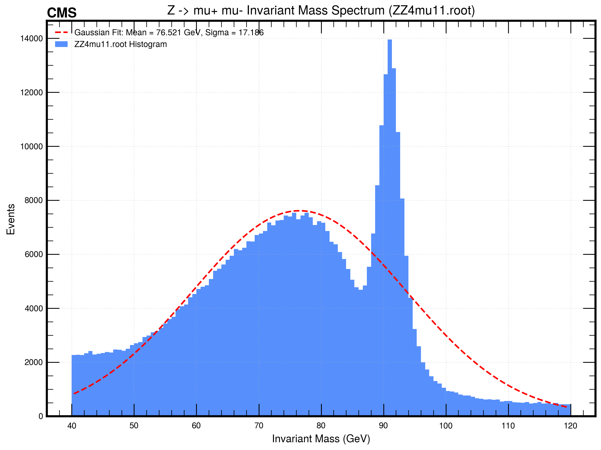  
*ZZ4mu11: μ⁺μ⁻ Invariant Mass Spectrum*

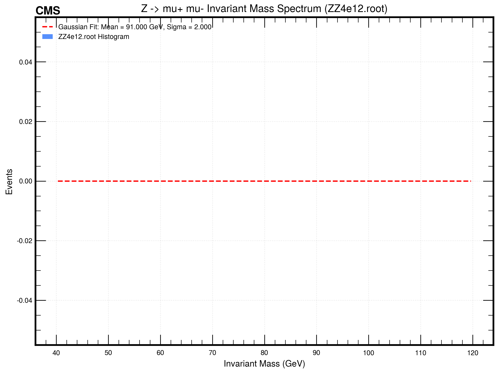  
*ZZ4e12: μ⁺μ⁻ Invariant Mass Spectrum*

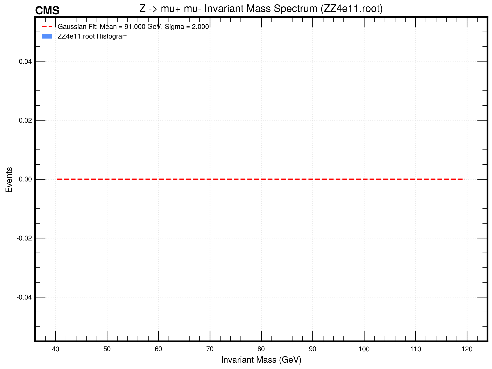  
*ZZ4e11: μ⁺μ⁻ Invariant Mass Spectrum*

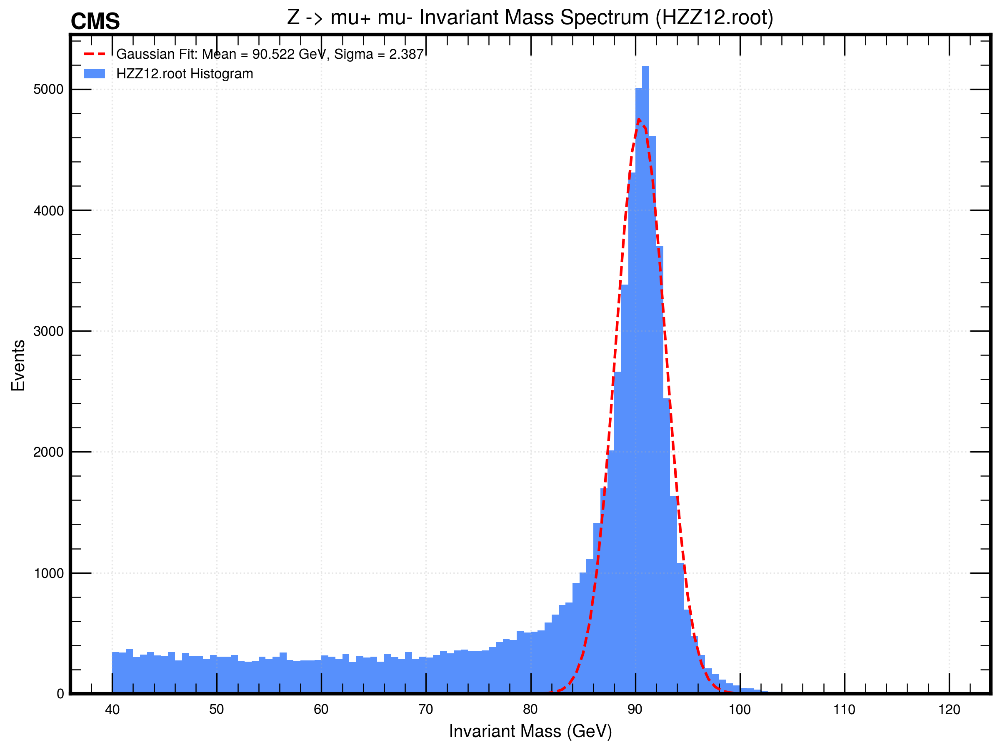  
*HZZ12: μ⁺μ⁻ Invariant Mass Spectrum*

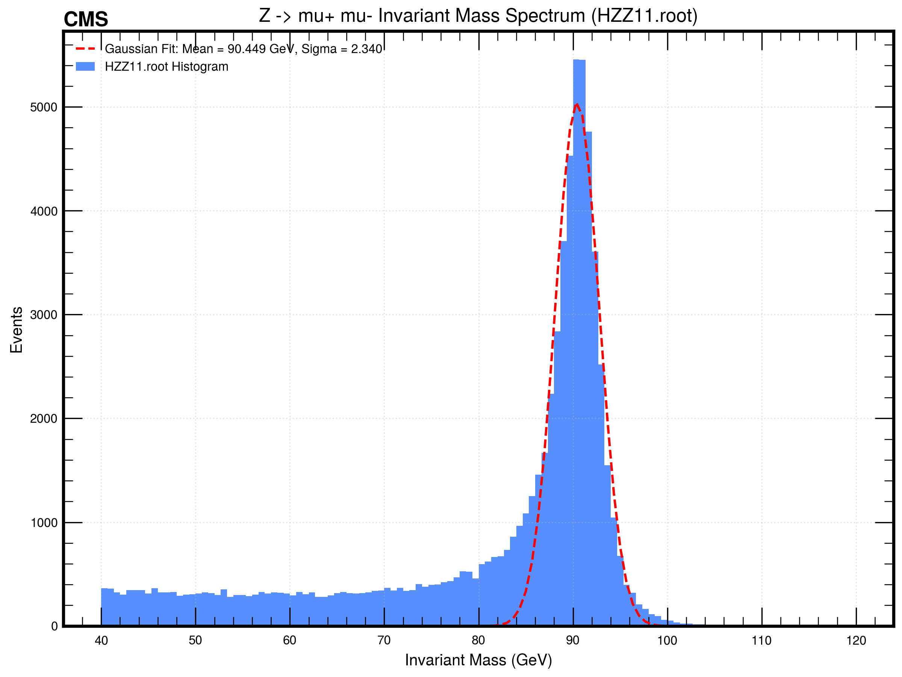  
*HZZ11: μ⁺μ⁻ Invariant Mass Spectrum*

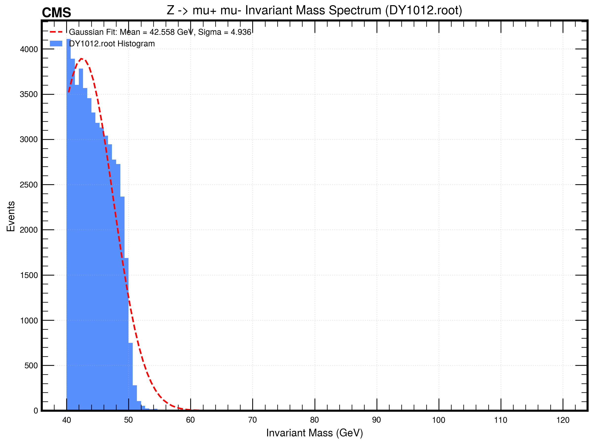  
*DY1012: μ⁺μ⁻ Invariant Mass Spectrum*

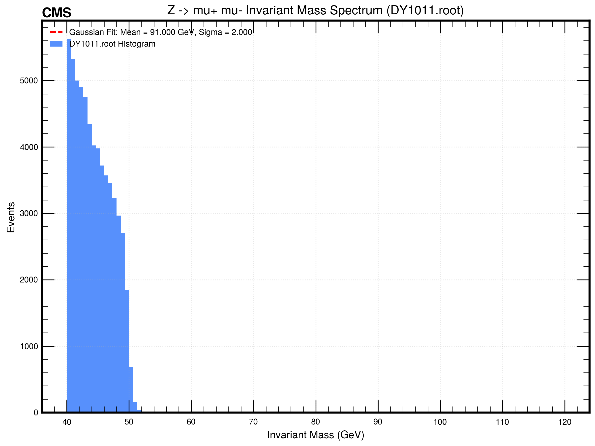  
*DY1011: μ⁺μ⁻ Invariant Mass Spectrum*

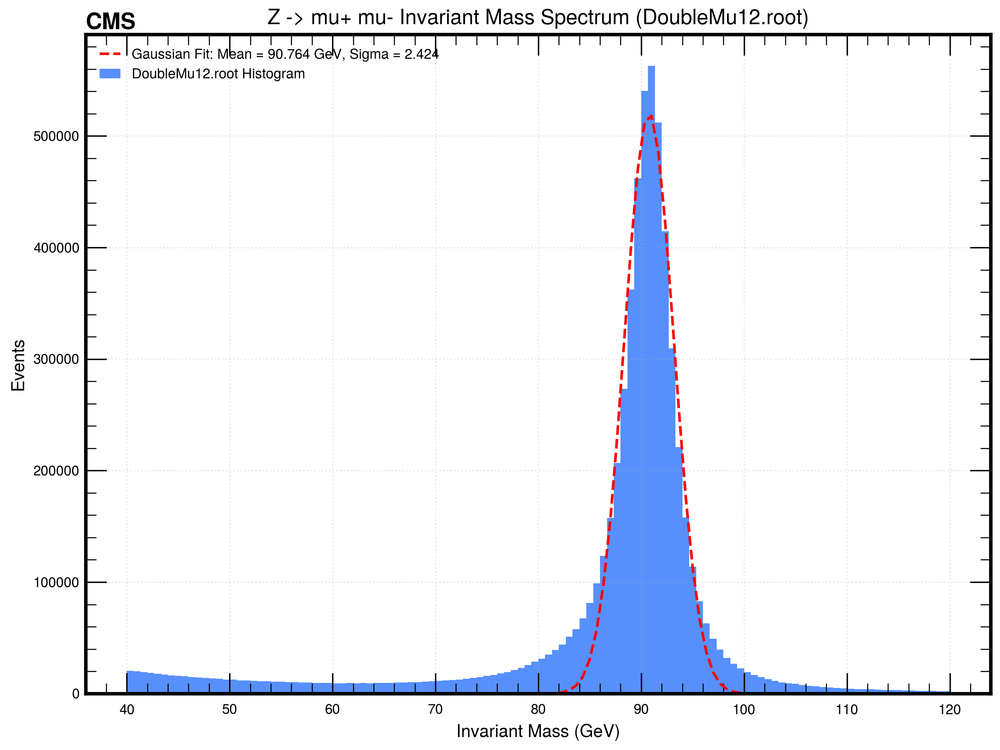  
*DoubleMu12: μ⁺μ⁻ Invariant Mass Spectrum*

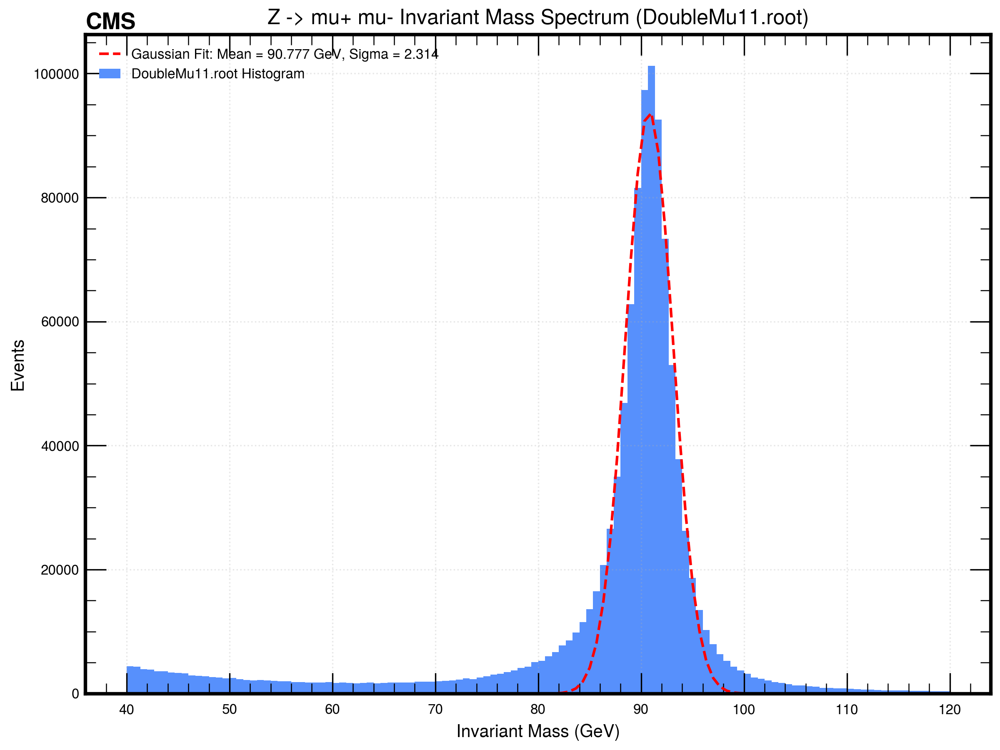  
*DoubleMu11: μ⁺μ⁻ Invariant Mass Spectrum*

